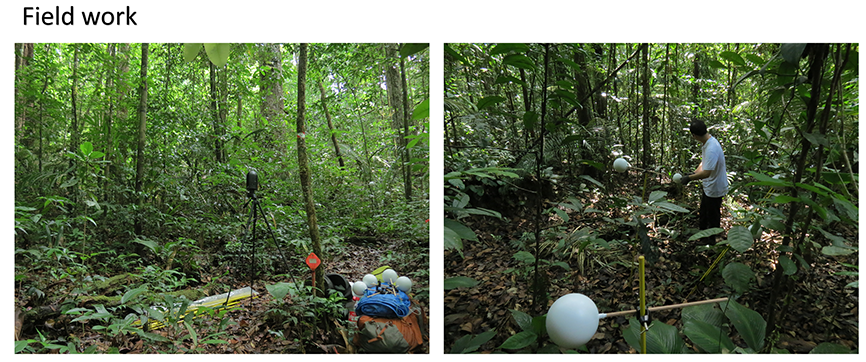
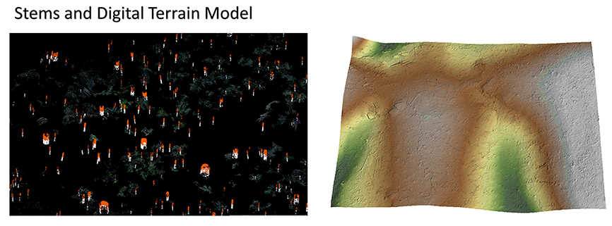

# BLK360 laser scanning of rainforests

   --------------------------  
   
**In 2019, a permanent 12-ha rainforest plot in East Amazonia, called “Petit Plateau”, was scanned using two BLK360 laser scanners.**  

**A new algorithm was then developed for detecting tree stems and for extracting ground points from the laser scanning data. 36,422 stems were detected, of which 29,665 (81%) were in the 3-10 cm DBH range.**  

**Point cloud files of the plot have been made publicly available at:**  
https://doi.org/10.6084/m9.figshare.14061602.v2

# Reference  
Tao et al. Annals of Forest Science.

# Contact  
Shengli Tao  
sltao1990@gmail.com  

# Link  
[Shengli Tao on Google Scholar](https://scholar.google.com.hk/citations?user=7NJkU6cAAAAJ&hl=en&oi=ao)  
[Shengli Tao in EDB Lab](https://edb.cnrs.fr/annuaire/shengli-tao/) 
