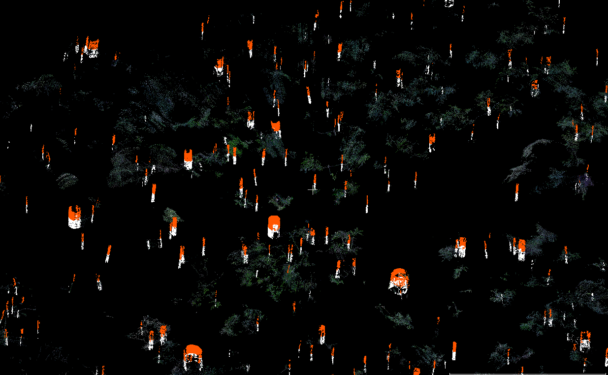

# BLK360 laser scanning of rainforests

**In 2019, a permanent 12-ha rainforest plot in East Amazonia, called “Petit Plateau”, was scanned using two BLK360 laser scanners.  
A new algorithm was then developed for detecting tree stems from the laser scanning data.  
36,422 stems were detected, of which 29,665 (81%) were in the 3-10 cm DBH range.** 

Point cloud files of the plot and the detected stems are available at:  
https://filesender.renater.fr/?s=download&token=c7195ddc-7773-4e7e-840b-8ebd483cec8f

# Reference  
Tao et al. Annals of Forest Science. In Revision.

# Contact  
Shengli Tao  
sltao1990@gmail.com  
https://edb.cnrs.fr/annuaire/shengli-tao/
